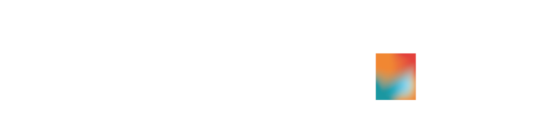

  <h1> <i>Encantat</i> 👋, I'm Gerard! </h1>
  
   <!-- LINKEDIN -->  <!-- TWITTER --> 

## A little bit about me

Amongst other things: I love maths, physics, modelling & computers. No wonder why we started [Nebbo](https://linkedin.com/company/nebbo-weather), right? But did you know... 

- 🔭  is a seasonal weather forecasting company, a [Vortex](https://www.linkedin.com/company/vortex/) _spin-off_, in which I am working as Technical Director 
- 🌱 I studied Maths & Physics in [UAB](https://www.uab.cat/web/estudiar/ehea-degrees/general-information/physics-mathematics-1216708259085.html?param1=1216795185845), and Data Science in [UB](https://mat.ub.edu/sciencedata/)
- 💬 Ask me about diving, nature and sport and I will not shut up 
- 📫 Reach me: messaging through my [LinkedIn](https://www.linkedin.com/in/gcastro98/)
- 😄 Pronouns: he/him

<!--
## Github stats

 
<!--  -->

<!--
Specifically, regarding my python most used packages, the following can be distinguished:

     
-->

<!-- ## My trophies --> 
<!--  -->

<!-- Badges: https://github.com/alexandresanlim/Badges4-README.md-Profile -->
<!-- Visitor badge: https://www.visitorbadge.io/ -->
<!-- For more badges... https://github.com/badges/shields -->
